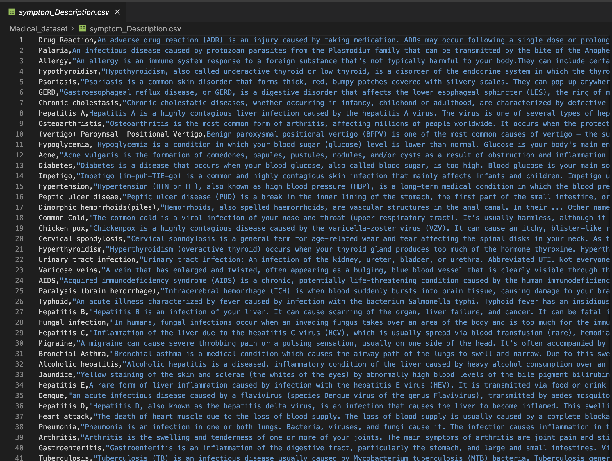
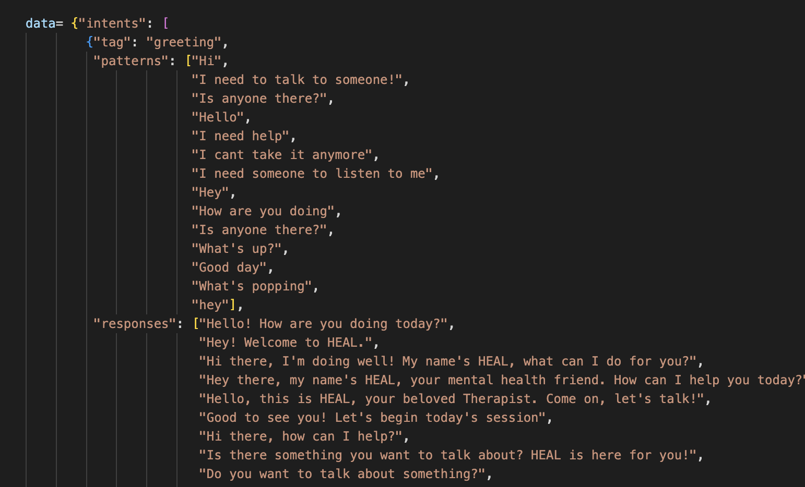
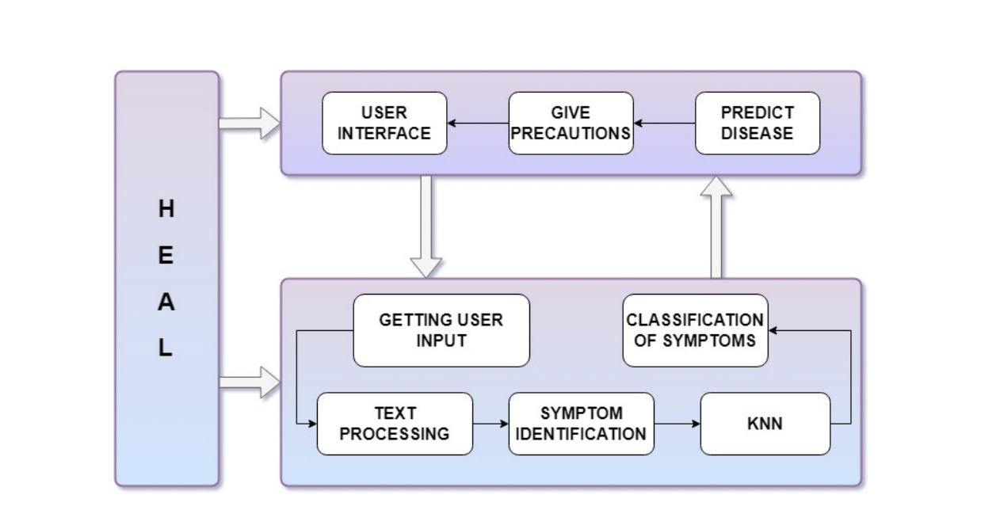
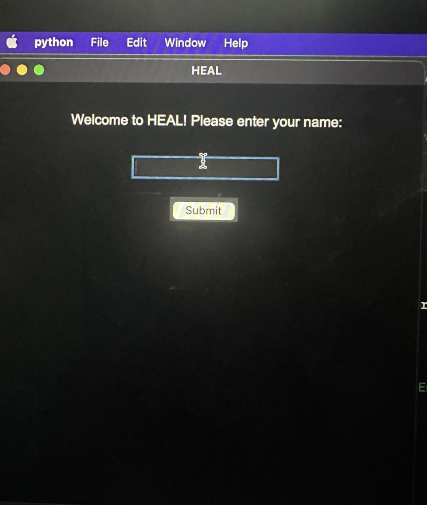
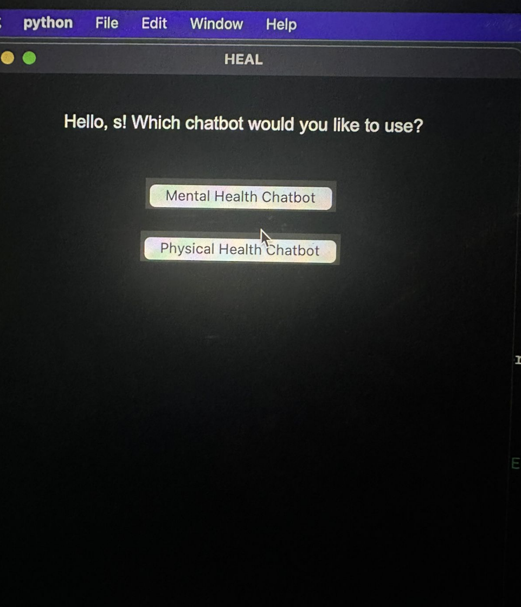
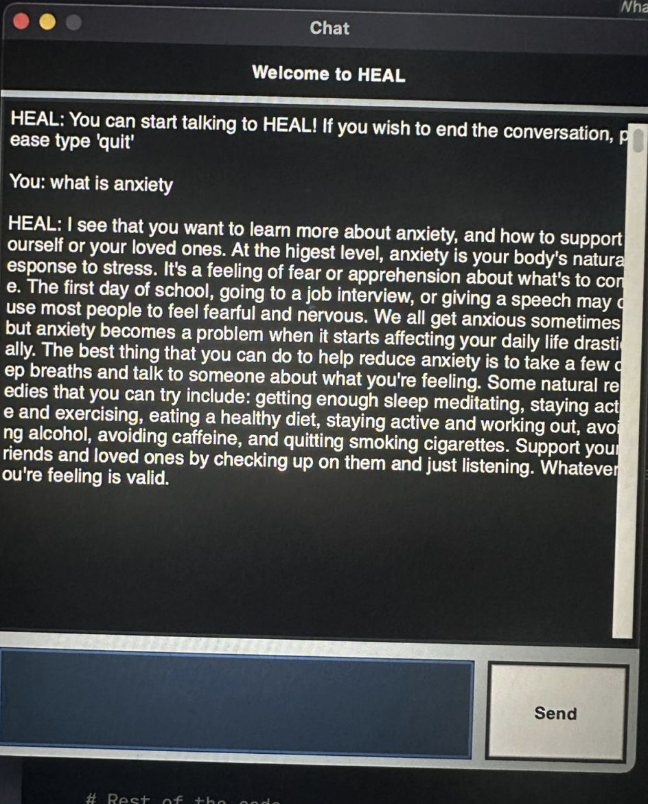
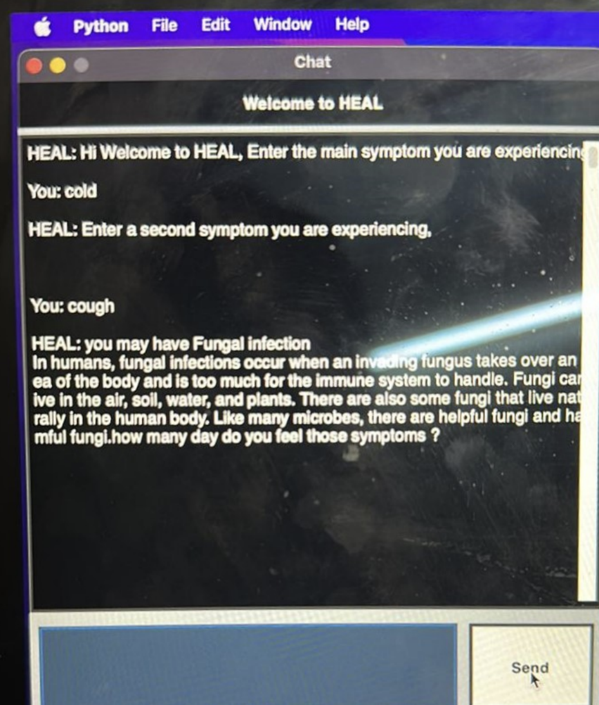

# HEAL: HEALTHCARE EMERGENCY ASSISTANTAND LOGISTICS CHATBOT

## Introduction
The delivery of patient care has changed dramatically in recent years, thanks to technological improvements in the healthcare sector.Similarly, to address the growing need for
affordable and effective healthcare service, chatbots have been introduced.Appropriate
healthcare is crucial to maintaining a healthy lifestyle. To make a doctor’s appointment for every health issue, nevertheless, may be quite difficult. The idea is to create a
desktop application HEAL consisting of physical and mental care chatbot using artificial intelligence that can recognise the condition and give rudimentary details about it
before consulting a doctor

| Existing Problems       | Benefits of the chatbot    |
|------------------------|----------------------|
| Fragmented Care        | Symptom Assessment and Triage   |
| Limited Accessibility | Unified Care        |
| Lack of Integration    | Relaxation to Healthcare Professionals |
| Stigma and Discrimination | Unbiased Treatment |
| Healthcare System Burden | Friendly Environment |

# Data Collection

* Data used in Physical Symptom Assessment chatbot, we have used an open-source
dataset from online source consisting of three .csv files. These files contain the description of diseases, precautions and severity of Symptom. Example of one dataset file is present below:

* Data used in Mental Conversational model, we have personally generated simulated
conversation within the main file. The goal of data production was to provide plausible dialogue situations that included a variety of user interactions and mental health
issues. These simulated conversations were designed to imitate genuine interactions
between individuals seeking mental health care and the chatbot. We have included responses based on the tags whether its greeting or information about conditions such as
schizophrenia, depression and anxiety. We have included jokes and inspirational quotes
to lift the mood of patient.

# NLP in Chatbot

In HEAL Symptom assessment Component, we have used Spacy which is an open
source library for NLP in Python to Understand the input given by the users. The
Symptom entered by the user goes through several steps to make chatbot understand it.
The steps performed to Understand user’s Input are:

* **Getting all Symptoms:**
In this the code cleans the symptom names, checks for synonyms using WordNet
in Natural Language Toolkit (NLTK), and categorizes the symptoms into two lists
based on whether they have synonyms or not.

* **Preprocessing Text:**
During Preprocessing of the text, removing stop words and tokenization using
lemmatization are incorporated. Removal of Stop words are employed to remove
unwanted words from the text. Tokenization is the conversion of sentences into
understandable bits of data. With Lemmatization, the tokens are reduced to their
root form to identify similarity.

* **Syntactic Similarity:**
The premise behind the syntactic similarity is that the similarity between two
texts is inversely correlated with the number of identical words in those texts.
The method used to Calculate Syntactic Similarity in HEAL is Jaccard Similarity.
The amount of shared unique word roots between the two texts is proportional to
the Jaccard similarity index. It is inversely related to the total number of distinct
word roots found in the two texts.

* **Semantic Similarity:**
The task of determining how similar two texts are in terms of meaning is known
as semantic similarity. These models accept a source sentence and a list of other
sentences to compare, and they then provide a list of similarity scores

* In HEAL mental care conversational component, we have used **Bag of Words (BOW)**
to process the text entered by the User. BOW keeps track of the total number of times
the most frequently employed words are utilised.

## ML Algorithms

ML is a field of AI that focuses on building algorithms and models that enable computers to learn from data and make predictions or judgments without being explicitly
programmed. It entails developing and researching algorithms that can learn from data
and make predictions or take actions based on that data. In HEAL we are using two ML
algorithms. KNN for Disease prediction and DNN for conservational model.

### KNN
One of the core machine learning algorithms is KNN. A collection of input values are
used by machine learning models to calculate potential output values. One of the simplest machine learning algorithms, KNN is mostly employed for categorization. The
data point is categorised based on how its neighbour is categorised. Based on the
similarity score of the previously stored data points, KNN categorises the new data
points.The K in KNN stands for how many nearest neighbours we applied to categorise
18
brand-new data points. The KNN classification depends on a distance metric. To calculate the nearest neighbor, we usually use Euclidean distance . 

## System Architecture

Here we see the flow with which HEAL interacts with the users and provides response
to their query.

## GUI Output

## Conclusion

In conclusion, the creation of a healthcare chatbot has the power to alter how people engage with and receive medical services completely. The chatbot can comprehend customer inquiries and provide prompt, correct responses by utilizing cutting-edge
technology like Natural Language Processing (NLP) and Machine Learning (ML). The
chatbot takes care of the consumers’ complete healthcare requirements by integrating
both mental and physical health on one platform.
The issue definition, aims, technique, and execution of the healthcare chatbot have
all been covered in this study. The use of Deep Neural Networks (DNN) for conversational mental health modelling and the K-Nearest Neighbours (KNN) method for physical symptom prediction shows how well machine learning approaches work to improve
chatbot functionality.
A fluid and intelligent conversation experience is guaranteed by the system design,
which includes elements like NLP, intent recognition, knowledge base, dialogue management, and backend services. Incorporating unbiased treatment suggestions further
encourages equitable and inclusive healthcare practises.
To review, The healthcare chatbot, which provides consumers with accessible, effective, and personalised treatment, is a significant innovation in the healthcare sector.
The accuracy, knowledge base, and usefulness of the chatbot must all be continually
improved, which calls for more study and development.
Overall, The healthcare chatbot has the potential to change how healthcare is delivered while also enhancing patient outcomes and expanding access to high-quality medical treatment. It facilitates efficient communication, symptom evaluation, and treatment
suggestions for both patients and healthcare professionals.

##  Future Scope

* The future of the healthcare chatbot is positive and there are plenty of opportunities for advancement. Here are
some potential future scopes:

* Enhanced Personalization:
The chatbot may be able to offer even more individualised and customised healthcare advice by using more sophisticated machine learning algorithms and methodologies. The chatbot may tailor its ideas and replies to specific users by examining user information, preferences, and previous interactions, resulting in a more
effective and personalised healthcare experience.

* Expansion of Medical Knowledge Base:
33
The chatbot’s medical knowledge base will be continuously updated and expanded to keep up with the most recent studies, technological developments, and
treatment methods. In order to make sure the chatbot gives correct and trustworthy information, regular updates may be made by working with medical publications, specialists in the field of healthcare, and other trustworthy sources.

* Natural Language Processing (NLP) Advancements:
The chatbot’s comprehension of sophisticated medical terminology, everyday language, and context-specific information may be improved with the help of new
NLP approaches. This would improve the chatbot’s capacity to recognise and
reply to user inquiries with accuracy, resulting in a more natural and user-friendly
interaction.

* Enhanced GUI:
The user experience of the healthcare chatbot may be greatly enhanced by improving the graphical user interface (GUI).Implementing Interactive elements can
also make user’s experience easy

## Contributors

