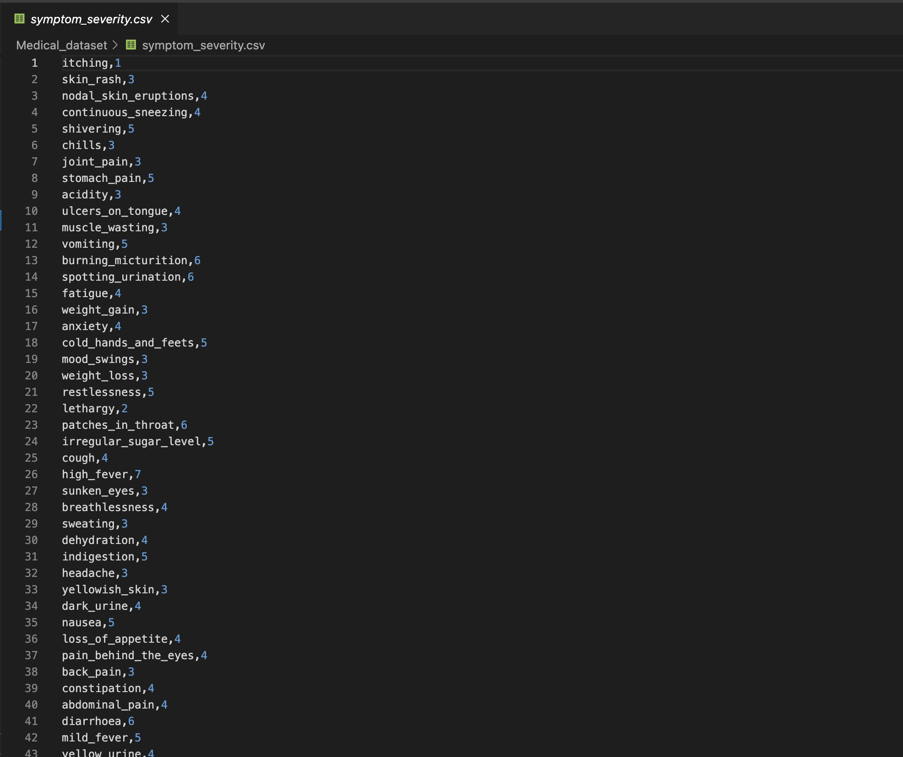
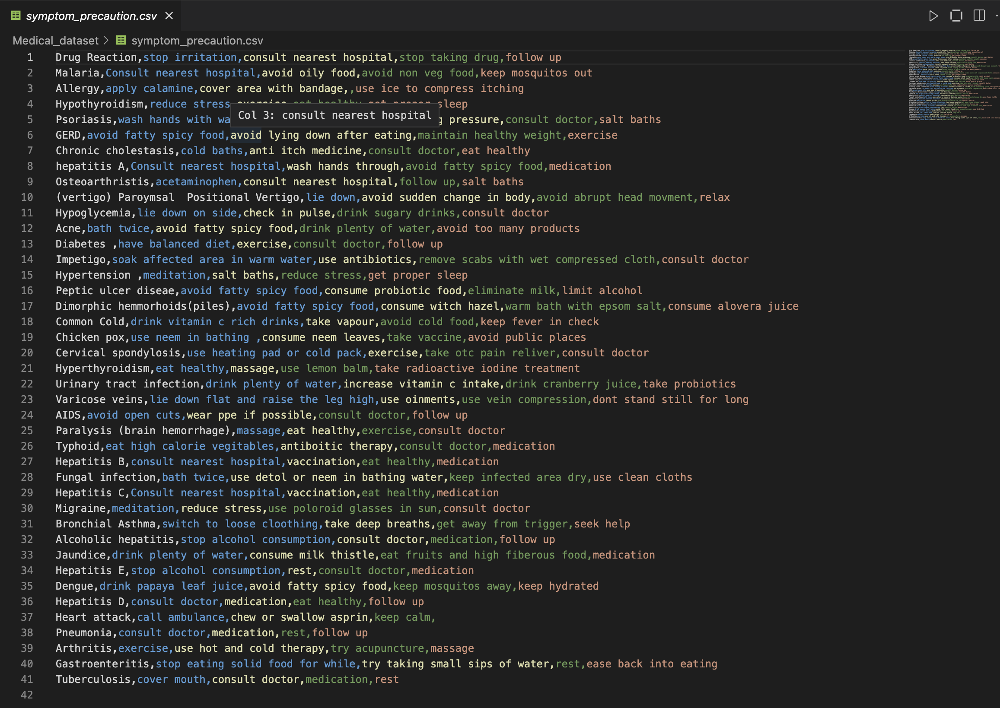

# HEAL: HEALTHCARE EMERGENCY ASSISTANTAND LOGISTICS CHATBOT

## Introduction
The delivery of patient care has changed dramatically in recent years, thanks to technological improvements in the healthcare sector.Similarly, to address the growing need for
affordable and effective healthcare service, chatbots have been introduced.Appropriate
healthcare is crucial to maintaining a healthy lifestyle. To make a doctor’s appointment for every health issue, nevertheless, may be quite difficult. The idea is to create a
desktop application HEAL consisting of physical and mental care chatbot using artificial intelligence that can recognise the condition and give rudimentary details about it
before consulting a doctor

| Existing Problems       | Benefits of the chatbot    |
|------------------------|----------------------|
| Fragmented Care        | Symptom Assessment and Triage   |
| Limited Accessibility | Unified Care        |
| Lack of Integration    | Relaxation to Healthcare Professionals |
| Stigma and Discrimination | Unbiased Treatment |
| Healthcare System Burden | Friendly Environment |

# Data Collection

* Data used in Physical Symptom Assessment chatbot, we have used an open-source
dataset from online source consisting of three .csv files. These files contain the description of diseases, precautions and severity of Symptom.

* Data used in Mental Conversational model, we have personally generated simulated
conversation within the main file. The goal of data production was to provide plausible dialogue situations that included a variety of user interactions and mental health
issues. These simulated conversations were designed to imitate genuine interactions
between individuals seeking mental health care and the chatbot. We have included responses based on the tags whether its greeting or information about conditions such as
schizophrenia, depression and anxiety. We have included jokes and inspirational quotes
to lift the mood of patient.
